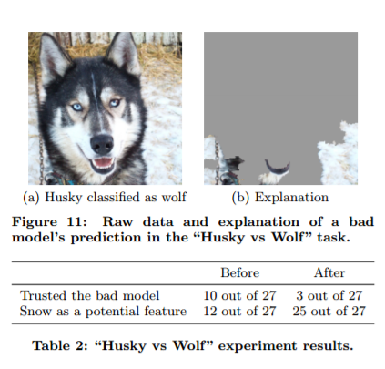

# Section 3: Preprocessing The Data

Among the most important aspect in any machine learning task is having high quality data. If your dataset is all noise, no signal, then we cannot expect a neural network to learn anything valuable from it. As the saying goes, "garbage in, garbage out." But what does it mean for data to be high quality?

High quality data must accurately reflect the real phenomena being studied. High quality data is *complete*, it doesn't have extensive missing values. High quality data is appropriately balanced within the domain. For machine learning in general, and neural networks in particular, high quality data must exist at a high volume as well.

Issues with data quality can arise from many sources. The collection process could be flawed. Errors can be introduced during collection or data entry. Data that accurately represents the status quo may very well encode status quo biases.

Before embarking on a new machine learning task, it's important for practitioners to ask a lot of questions about their data. A few examples:

* Does the collected data accurately reflect the world?
* Does the data have errors that were introduced at collection time, or any time after?
* Do you have enough samples of each class?
* Are those samples a complete (or nearly complete) representation of the class they represent?

Additionally, once you have high quality data, it must be appropriately encoded/formatted for a neural network to consume.

**By the end of this section students should be able to:**

* Describe problems with data sets that may arise before and during collection and their impact.
* Describe how neural networks can learn from unexpected aspects of the data.
* Describe class imbalance and its potential impact.
* Impute values for missing data points, and describe the strengths and weaknesses of this tactic.
* Transform categorical data into one-hot encoded vectors, and describe the importance of this approach.
* Augment image data to synthetically expand a dataset.

## Part 1: Bias in the World, Bias in the Data

A machine learning model is only objective in that it describes the data fed into it. When the data encodes biases that exist in the world, or the biases of the people who created the data, that bias is passed on to the model.

There has been an explosion of discussion around bias in machine learning, and the ethical implications of using it frivolously. Practitioners ignore this problem at their own peril.

Other problems can arise when an unexpected portion of the data explains the model's decision. Take this famous example from the [this paper](https://arxiv.org/abs/1602.04938):  

It is also worth noting that the past is not the future. ML systems take past data to make future predictions, but this might not always be appropriate. For example, in terms of the number of battles won, the sword is a much more effective weapon than the cruise missile.

### Pre-Reading

* [This is how AI bias really happens—and why it’s so hard to fix](https://www.technologyreview.com/s/612876/this-is-how-ai-bias-really-happensand-why-its-so-hard-to-fix/)
* [The Risk of ML Bias, and How to Prevent it](https://sloanreview.mit.edu/article/the-risk-of-machine-learning-bias-and-how-to-prevent-it/)

### Resources for Further Exploration

* [ProPublica Investigation: Machine bias](https://www.propublica.org/article/machine-bias-risk-assessments-in-criminal-sentencing)
* [When The Robot Doesn't See Dark Skin](https://www.nytimes.com/2018/06/21/opinion/facial-analysis-technology-bias.html)
* [Paper: Why Should I Trust You? Explaining the Predictions of Any Classifier](https://arxiv.org/abs/1602.04938)

## Part 2: Evaluating, Cleaning, and Preparing Structured Data

Some sorts of errors can be mitigated and addressed without recollecting the whole dataset. For example, if a handful of data points have missing values, we can infer from the rest of the data acceptable values to use. Indeed, we *always* assume there is some degree of noise in our dataset, adding a small amount of noise ourselves is often acceptable. Especially if it means we can actually run the model!

We'll look at some tactics for examining the data, and for fixing it up for processing. We'll also look at some preprocessing requirements and best practices such as formatting categorical data and normalizing range data.

### Pre-Reading

* [How To Prepare Your Data For Machine Learning in Python with Scikit-Learn](https://machinelearningmastery.com/prepare-data-machine-learning-python-scikit-learn/)

### Helpful Documentation

* [SciKit.Learn Preprocessing](https://scikit-learn.org/stable/modules/preprocessing.html)

### Resources for Further Exploration

* [The complete beginner’s guide to data cleaning and preprocessing](https://towardsdatascience.com/the-complete-beginners-guide-to-data-cleaning-and-preprocessing-2070b7d4c6d)
* [How to Improve Neural Network Stability and Modeling Performance With Data Scaling](https://machinelearningmastery.com/how-to-improve-neural-network-stability-and-modeling-performance-with-data-scaling/)
* [Part 1 of Stanfords cs231n, Setting up the data](http://cs231n.github.io/neural-networks-2/)

### Part 3: Image Augmentation

Image augmentation is a powerful way to turn a small data set into a larger one, and protect your network from overfitting to the training data.

### Pre-Reading

* [How to Configure Image Data Augmentation When Training Deep Learning Neural Networks](https://machinelearningmastery.com/how-to-configure-image-data-augmentation-when-training-deep-learning-neural-networks/)

### Helpful Documentation

* [Keras: Image Preprocessing](https://keras.io/preprocessing/image/)
* [PIL Image Module](https://pillow.readthedocs.io/en/stable/reference/Image.html)
* [PIL ImageOps Module](https://pillow.readthedocs.io/en/stable/reference/ImageOps.html)

### Resources for Further Exploration

* [Image Augmentation for Deep Learning With Keras](https://machinelearningmastery.com/image-augmentation-deep-learning-keras/)
* [Data Augmentation: How to use Deep Learning when you have Limited Data](https://medium.com/nanonets/how-to-use-deep-learning-when-you-have-limited-data-part-2-data-augmentation-c26971dc8ced)
* [Paper: The Effectiveness of Data Augmentation in Image Classification using Deep Learning](http://cs231n.stanford.edu/reports/2017/pdfs/300.pdf)
* [Preprocessing for deep learning: from covariance matrix to image whitening](https://medium.freecodecamp.org/https-medium-com-hadrienj-preprocessing-for-deep-learning-9e2b9c75165c)
