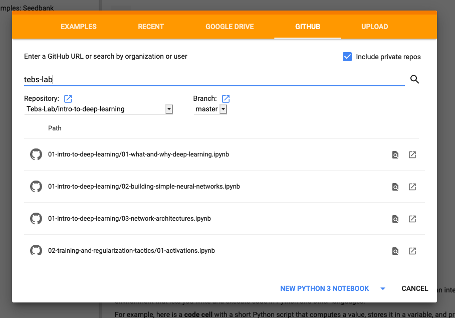

# Introduction To Deep Learning

Welcome to the Teb's Lab introduction to deep learning curriculum. These materials are meant to support instructors and self learners who want to dive into the world of neural networks and deep learning. The structure of this repository is an ordered collection of introductory reading materials, practical walk throughs, and additional resources to help you practice and explore these topics in more depth.

These resources are primarily targeting people who are getting started with machine learning, and they not a comprehensive study of deep learning. Since the field seems to evolve every few minutes, some of the information here might be outdated by the time you arrive. With that in mind, these materials put a focus on the foundational information that can serve as a jumping off point for future study.

Each folder represents a larger sub-topic within the field of deep learning. Within each folder you'll find a readme and a series of Jupyter Notebooks. Each readme contains a brief overview of the topic and describes the sub-topics. Each sub-topic has pre-reading suggestions, a Jupyter Notebook that demonstrates how to put the concepts in the pre-reading into practice, documentation related to the techniques and tools used in the notebook, and suggested resources for further exploration of the sub-topic.

While the notebooks strive to adequately describe their topics, they all have conspicuous imperfections. Students using these materials are strongly encouraged to not just read the notebooks, but change and expand them in order to improve the performance of the models therein. Doing so will significantly improve your understanding of the topics presented.

Some subdomains are conspicuously missing, such as Generative Adversarial Networks (GAN) and Natural Language Processing (NLP). These topics may be added at a later date. However, it is our hope that the information in these notebooks is sufficient that students who work through it will be able to explore these more advanced topics on their own.

## Using These Materials

### Running The Notebooks Locally

These materials are not static, and are not meant to be consumed that way. While we believe reading through at the information in the Jupyter Notebooks as they are is a useful reference, and a helpful starting place, the format was chosen to encourage modification and exploration. We suggest that students fork this repository then clone it onto their machine and make significant alterations to the notebooks as they explore deep learning. If you're new to Git/Github you can learn how to [fork and clone the repo here](https://help.github.com/en/articles/fork-a-repo)

To run the notebooks, you'll need to have Python3 and [`pipenv`](https://pipenv.readthedocs.io) installed. Instructions for installing Pipenv can be found at the previous link. Most computers come with a version of Python3 already installed, but if yours does not you may [follow these instructions](https://realpython.com/installing-python/). Once you have installed Python3 and Pipenv navigate to the main repo folder and run the following commands:

```
pipenv install
pipenv shell
jupyter contrib nbextension install --user
jupyter nbextensions_configurator enable --user
jupyter notebook
```

For subsequent runs, you'll only need to run:

```
pipenv shell
jupyter notebook
```

A new tab should open in your web browser allowing you to navigate the Jupyter Notebooks.

#### Note: Dev Dependencies for Reinforcement Learning Sections

> Current release does not have RL labs up to date with TensorFlow 2, and I have been made aware there are additional difficulties installing box2d on OSX after Catalina... We're working on it.

The Deep Reinforcement Learning sections require additional dependencies that are, in many cases, not as simple to install. These dependencies are listed as dev-packages in the `Pipfile`, and as such are **not** installed by default. These packages, specifically the code that allows OpenAI's `gym` package to run Atari games, cannot all be installed using `pip` or `pipenv` alone. To run the code in sections 5 & 6, you will need to do the following:

Install `box2d` and `ffmpeg` using something other than `pip`:

For Mac users:

```
brew install box2d
brew install ffmpeg
```

For other platforms, or more details, see the following:

* [Box2D installation help, Windows](https://towardsdatascience.com/how-to-install-openai-gym-in-a-windows-environment-338969e24d30)
* [All OpenAI Gym dependencies guide, Linux](http://www.kiranjose.in/blogs/getting-started-with-openai-gym-part-1-installation-and-configuration/)
* [FFMPEG Installation help](https://github.com/adaptlearning/adapt_authoring/wiki/Installing-FFmpeg)

Once `box2d` and `ffmpeg` have been installed install the dev-packages using this command:

`pipenv install -d`

### Using Google Colab

Alternatively, most of these notebooks can be run on [Google Colaboratory](https://colab.research.google.com) directly. Google Colab has options to open Jupyter Notebooks directly from Github. When you land on the Colab homepage a box with a gold/orange navigational header will appear, click the "Github" link and type "tebs-lab" into the provided search bar, then in the drop-down menu select this repository, "intro-to-deep-learning".



A list of all the notebooks in this repo should appear. Select the one you wish to open and you should be off to the races.

The Colab approach has a handful of downsides. First, for some of the labs (in particular the Deep Reinforcement Learning material) require dependencies that are not supported out of the box on Colab. There are ways to [add these dependencies to a Colab instance](https://cloud.google.com/datalab/docs/how-to/adding-libraries), but it is not always straightforward to do so.

Secondly, some of the notebooks require external data sets that, for either size or licensing reasons, cannot be included in this repository itself. In those cases we have tried to leave clear instructions on how to obtain the relevant datasets and other resources. Data wrangling is a very real part of work as a machine learning practitioner, and we believe these exercises to be valuable practice. Again, it is [possible to upload this data into Colab](https://medium.com/@yuraist/how-to-upload-your-own-dataset-into-google-colab-e228727c87e9) but not as easy as running the labs locally.

If you have a computer without much processing power, Colab is a good way to leverage Google's computational resources to get better performance and decrease training time.

## Big Picture Resources

Each class and section has its own resources and reading material to help students prepare for each individual topic, and explore that topic further. While these piecemeal resources are useful, it is also helpful to have larger, cohesive, and more complete resources to rely on. Additionally, this course focuses heavily on practical application of deep learning tactics.

The following resources dive more deeply into the theory and mathematics of deep learning in a way that many of the individual readings do not. These are big picture, cohesive, complete resources, and they will be useful to curious students throughout the course and beyond.

* [The Deep Learning Book](http://www.deeplearningbook.org/)
* [Neural Networks and Deep Learning](http://neuralnetworksanddeeplearning.com)
* [Reinforcement Learning: An Introduction](http://incompleteideas.net/book/bookdraft2017nov5.pdf)

## Public Datasets

Throughout this course, you'll be learning more about how to use neural networks through the use of specific datasets. In order to put these skills into practice, it's a great idea to try putting these principles into practice. Kaggle has a lot of great datasets for you to do this, check it out:

* [Big list of public Kaggle datasets (classification & regression)](https://www.kaggle.com/annavictoria/ml-friendly-public-datasets)
* [Oxford-IIT Pet Dataset (object localization & segmentation)](http://www.robots.ox.ac.uk/~vgg/data/pets/)

## Copyright and Licensing

The purpose of this repository is purely educational.

The information and code here is provided without warranty of any kind.

All of the original code and writing in this repo has been released to the public domain. You may use it for any purpose whatsoever, without restriction.

There are a handful of images that are linked from external articles and therefore covered by existing copyrights. Teb's Lab makes no claim on these materials, nor are they included in the public domain dedication. Such images are clearly labeled with their source in the notebooks in which they appear. If you wish to use those images in a way that is not covered by fair use, it is your responsibility to obtain permission from the copyright owner before doing so.

## Support Teb's Lab

These materials were created by [Tyler Bettilyon](https://www.linkedin.com/in/tylerbettilyon/) and [Teb's Lab](https://tebs-lab.com). You can support the creation of more free, open source, public domain educational materials by sharing them with others and [subscribing to our newsletter](http://eepurl.com/dum8IP).
